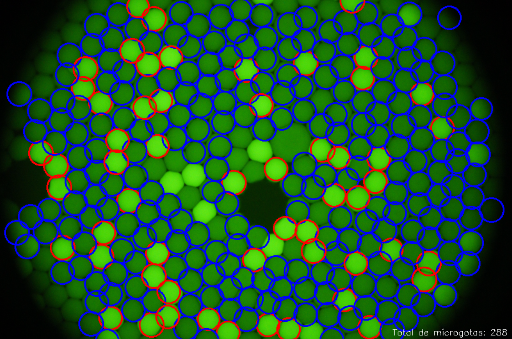

<h1>Quatification of viral charge (SARS-Cov2) on microdroplets using OpenCV and image processing</h1>
This is our bachelor thesis topic about quantification of viral charge (SARS-Cov2) on microdroplets using OpenCV and Image processing techniques with python programming language by Zuleima Hidalgo JAime and Isai Sanchez Jimenez.
<h2>Abstract</h2>

The techniques for counting por PCR viral detection are advancing,
one way to do it is through microdroplets counting wich can be manually and 
a hard task and the other way is using the technology, computer vision and Machine Learning
to count and obtain information to process and analyze images.

 

